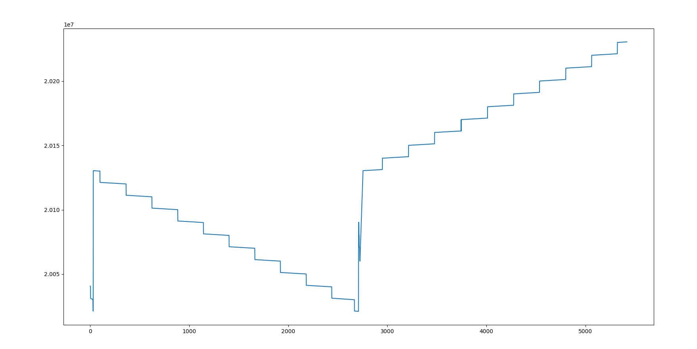

# SGX-Downloader

A Python script to download daily derivative data from the SGX website.

## Install the requirements

Make sure you have Python and pip installed. Run one of these command:

```bash
pip install -r requirements.txt
# or
pip3 install -r requirements.txt
```

## Command

The usage of the script and its explaination. Run `sgx-downloader.py` to see it.
```
usage: sgx-downloader.py [-h] [-c CONFIG] [-o OUTPUT] [-f FILE [FILE ...]]
                         [-l LOGFILE] [-E ERROR] [-L LOGLEVEL] [-n PAST]
                         [-m MAX_RETRY] [-r [RETRY]] [-q] [-u] [--day [DAY]]
                         [-s START] [-e END]

SGX derivatives data downloader

options:
  -h, --help            show this help message and exit
  -c CONFIG, --config CONFIG
                        Specify the path to the config file.
  -o OUTPUT, --output OUTPUT
                        Specify the directory to save data.
  -f FILE [FILE ...], --file FILE [FILE ...]
                        List of files you want to download. It can be a set of
                        the files listed in the FILE_NAME section in the
                        config file. Example '--file td tds tc' for download
                        Tick Data, Tick Data structure, and Trade Cancellation
                        and not download Trade Cancellation structure (tcs).
  -l LOGFILE, --logfile LOGFILE
                        Log file path, default is sgx-downloader.log.
  -E ERROR, --error ERROR
                        Path to the file that stores the list of failed
                        downloads.
  -L LOGLEVEL, --loglevel LOGLEVEL
                        Log level for logging file.
  -n PAST, --past PAST  Download data from the past N day.
  -m MAX_RETRY, --max_retry MAX_RETRY
                        The maximum number of times try to redownload a file
                        when it fails (max_retry >= 0). Set max_retry=0 for no
                        automatic re-download.
  -r [RETRY], --retry [RETRY]
                        Redownload files listed in ERROR. This option requires
                        a path to the ERROR file or it will take the default.
  -q, --quiet           Turn off the verbose mode (less annoying text, the
                        lower level will be only saved into the log file).
  -u, --update          Download the latest data (data from yesterday).
  --day [DAY]           Download data for a specific day.
  -s START, --start START
                        Start date of a range download job.
  -e END, --end END     End date of a range download job.

```

## Run with config file

The script load a config from '~/.config/sgx-downloader.cfg' in Linux and from '%APPDATA%/sgx-downloader.cfg' in Windows. You can change the config file or make your own following the example_config.cfg.

```bash
sgx-downloader.py -c /path/to/config/file
sgx-downloader.py -c example_config.cfg
```

Read files in the 'Example_config' for options in config.


## Example command

What things can this script do?

- Update the latest data (download yesterday's data): `sgx-downloader.py -u`
- Download data of a specific day: `sgx-downloader.py --day 20200516`
- Download data between 2 days: `sgx-downloader.py --start 20200501 --end 20200516`
- Download data of specific day and save it in 'mydir' directory: `sgx-downloader.py --day 20200516 --output mydir`
- Download data combine of a specific day, between 2 days and from the past 7 days: `sgx-downloader.py --day 20220102 --start 20200501 --end 20200505 --past 7`
- Download data file only (not structure file): `sgx-downloader.py --day 20200516 --file td tc`
- Download data structure file only: `sgx-downloader.py --day 20200516 --file tds tcs`
- Set number of times to redownload (default is 3): `sgx-downloader.py --day 20200516 --file tds tcs --max_retry=1`
- Redownload files listed in `sgx-failed.txt`:
  `sgx-downloader.py --retry sgx-failed.txt`
## Structure

The data downloaded will be saved with this structure
```
├── DerivativesHistorical
│   ├── 20230511
│   │   ├── TC_20230511.txt
│   │   ├── TC_structure.dat
│   │   ├── TickData_structure.dat
│   │   └── WEBPXTICK_DT-20230511.zip
│   ├── 20230512
│   │   ├── TC_20230512.txt
│   │   ├── TC_structure.dat
│   │   ├── TickData_structure.dat
│   │   └── WEBPXTICK_DT-20230512.zip
│   ├── 20230515
│   │   ├── TC_20230515.txt
│   │   ├── TC_structure.dat
│   │   ├── TickData_structure.dat
│   │   └── WEBPXTICK_DT-20230515.zip
│   └── 20230516
│       ├── TC_20230516.txt
│       ├── TC_structure.dat
│       ├── TickData_structure.dat
│       └── WEBPXTICK_DT-20230516.zip
├── example_config.cfg
├── README.md
├── requirements.txt
├── sgx-downloader.log
├── sgx-downloader.py
└── sgx-failed.txt
```

## Logging

There are 2 log files.

The first log file is a standard log which can be specified path by `--logfile` and use `--loglevel` to determine which type of log will be saved.

The second log file is to store the list of link and info about it that the file download failed (default is `sgx-failed.txt` or you can specify the path by option `--error`).

## Recovery

By default, it automatically redownloads files if failed in `max_retry` times. If it failed the last time then info about the failed file will be saved into `sgx-failed.txt` (default) and you can redownload after by option `--retry`.

# Appendix

## Idea

You will able to download the file you need if you know the link to it like this:
`https://links.sgx.com/1.0.0/<data-category>/<day_id>/<file_type>`.

where `<data-category>` can be derivatives-historical or derivatives-daily.

Example: If you want to download TickData of 16 May 2023. You will get it from https://links.sgx.com/1.0.0/derivatives-historical/5420/WEBPXTICK_DT.zip

- `5420` is the no of record (The 5420th record) or can simply call it day_id.
- `WEBPXTICK_DT.zip` is the general name for TickData file, when downloading from the web, the name of the file you get is `WEBPXTICK_DT-20230516.zip` so can simply call `WEBPXTICK_DT.zip` is file_type.


The link pattern can be:
- For derivatives historical data: `https://links.sgx.com/1.0.0/derivatives-historical/%%d/%%s`
  - FILE_NAME:
    - td: WEBPXTICK_DT.zip
    - tds: TickData_structure.dat
    - tc: TC.txt
    - tcs: TC_structure.dat
  - keyfilename: `tc` or `td`
- For derivatives daily data: `https://links.sgx.com/1.0.0/derivatives-daily/%%d/%%s`
  - FILE_NAME:
    - fut: FUTURE.zip
    - opt: OPTION.zip
  - keyfilename: `fut` or `opt`

Specify the link pattern in the config file then config some other setting to download the files you want.

Some fact:
- <day_id> is the order of the record set that SGX has. Ex: The data of 16 May 2023 is the 5420th record set so day_id('20230516') = 5420 and day_id('20230515') = 5419, data available only in business (exclude Sat and Sun) day so day_id('20230509') = 5415.

- If we know a pivot date with its <day_id> (we known a pivot is 20230516 with id 5420) then we can find the link for a specific day you want to download.

- We can find the <day_id> by subtracting the difference from the pivot date. A problem is some <day_id> does not exist (It will show a 404 page if you open it in the browser). It is not bad to find a NOT_DOWNLOADABLE list, the list of <day_id> that 404 error exists.

> Input is a query day as 'YYYYMMDD'. How can we find the <day_id>?


The above plot is relationship between <day_id> and <the_date> so with assume that <day_id> = a <the_date> + b, these following step work well for query date from 2014 (9 years ago).

>> Step 1: Determine whether the pivot date is in the future or in the past of the day we want.

>> Step 2: If the day is a weekend then it has no <day_id>.

>> Step 3: If not, calculate the `w` = number of weeks between the pivot date (we know day_id('20230516') = 5420) and the target date.

>> Step 4: Subtract the <day_id> of the pivotdate by 5 times `w` and now we can go backward (forward) the <day_id> to find the exact <day_id> of the day we want.

>> Step 5: After estimating the <day_id> by subtracting, we have to check <day_id> by connecting to the web and get the content disposition then compare it to the date in the filename that will be downloaded, if it is the day we want then download it.


## Suggest improving features and performance

1. Use cache to offload, only reloading downloaded files if the user forces the program to do so.
2. Use multiple threads to download a bunch of files at once.
3. Use a framework for accessibility when downloading another data category (Example: Historical Commodities Daily Settlement Price).
4. Change the algorithm to find <day_id> to work well with a longer period.